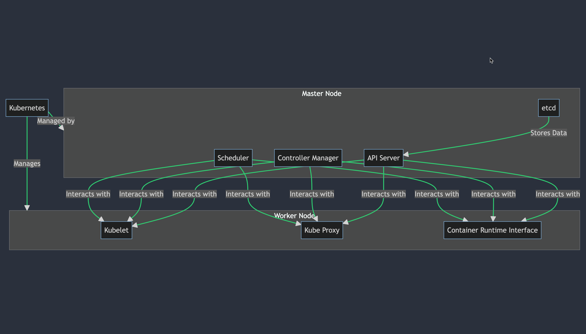

# Kubernetes Architecture

## Table of Contents

- [Introduction](#introduction)
- [Docker vs. Kubernetes: The Wrong Question](#docker-vs-kubernetes-the-wrong-question)
- [Understanding Kubernetes Architecture](#understanding-kubernetes-architecture)
- [Kubernetes: Not Just for Docker](#kubernetes-not-just-for-docker)
- [Making the Choice: Docker Swarm or Kubernetes?](#making-the-choice-docker-swarm-or-kubernetes)
- [Relevant Documentation](#relevant-documentation)
- [Conclusion](#conclusion)

## Introduction

Welcome to the world of Kubernetes! In this guide, we'll explore the role of Kubernetes as a container orchestration platform and clarify the relationship between Kubernetes and Docker.

## Docker vs. Kubernetes: The Wrong Question

First things first: let's address the common question of "Docker or Kubernetes?" It's essential to understand that Docker and Kubernetes are not competitors; they serve different purposes in the container ecosystem.

Docker is a container runtime platform that executes and manages containers. On the other hand, Kubernetes is a container orchestration system. While Docker Swarm and Kubernetes are both forms of container orchestration, they are not in direct competition. Docker has even announced support for Kubernetes on its platform. The key is to recognize that these tools have distinct functionalities for different use cases, just like a hammer and a wrench have different purposes.

## Understanding Kubernetes Architecture

Now let's delve into the architecture of Kubernetes. Think of Kubernetes as a container orchestration engine that allows you to deploy and manage a large number of containers within a clustered environment. Kubernetes supports various container runtimes, not just Docker. You can use alternatives like LXC (or Lexy) within a Kubernetes environment.

### Component Diagram

```plaintext
                    +-------------------------------+
                    |         Kubernetes            |
                    +-------------------------------+
                    |                               |
                    |   +-----------------------+   |
                    |   |  Master Components    |   |
                    |   +-----------------------+   |
                    |   |  - API Server         |   |
                    |   |  - Controller Manager |   |
                    |   |  - Scheduler          |   |
                    |   |  - etcd               |   |
                    |   +-----------------------+   |
                    |                               |
                    |   +-----------------------+   |
                    |   |   Worker Nodes        |   |
                    |   +-----------------------+   |
                    |   |  - kubelet            |   |
                    |   |  - kube-proxy         |   |
                    |   |  - Container Runtime  |   |
                    |   +-----------------------+   |
                    |                               |
                    |   +-----------------------+   |
                    |   |   Application         |   |
                    |   |   Components          |   |
                    |   +-----------------------+   |
                    |   |  - Pods               |   |
                    |   |  - Services           |   |
                    |   |  - Deployments        |   |
                    |   |  - ReplicaSets        |   |
                    |   +-----------------------+   |
                    |                               |
                    +-------------------------------+
```

Here's a breakdown of the Kubernetes architecture:

- **Pinehead (You)**: You interact with the Kubernetes master to convey your deployment requirements.
- **Kubernetes Master**: The master manages the entire cluster. It includes the following components:
    - **kube-apiserver**: Exposes the Kubernetes API, enabling communication between Pinehead and the master.
    - **etcd**: A consistent and high-value key store that serves as the backing store for all cluster data.
    - **kube-scheduler**: Determines which worker node should deploy a new pod based on factors like resource availability.
    - **kube-controller-manager**: Runs various controllers responsible for managing different aspects, such as nodes, replication, endpoints, service accounts, tokens, etc.
    - **cloud-controller-manager**: Integrates Kubernetes with the underlying cloud provider, enabling seamless interaction with cloud-specific resources.
- **Worker Nodes**: These nodes (previously referred to as "minion nodes") execute container workloads. Each node consists of the following components:
    - **kubelet**: The agent responsible for managing the node and communicating with the Kubernetes master.
    - **Container Runtime**: The tool used for container operations. It can be Docker, LXC (or Lexy), or any other compatible runtime.
    - **kube-proxy**: Runs the network proxy on each node, allowing services to communicate with each other and ensuring proper network configuration.

### Communication Diagram



## Kubernetes: Not Just for Docker

Kubernetes provides the ability to orchestrate containerized applications across a cluster of nodes, irrespective of the container runtime. This flexibility allows you to choose the most suitable runtime for your specific use case. Kubernetes takes container orchestration to a higher level by introducing the concept of a "pod," which is a group of containers deployed together on the same host. Pods offer shared resources, including network namespaces, volumes, and resource limitations.

## Making the Choice: Docker Swarm or Kubernetes?

Deciding between Docker Swarm and Kubernetes depends on your specific requirements and preferences. It's recommended to start with Docker to grasp the basics of containerization and container management. Once you're comfortable with Docker, you can easily transition to Docker Swarm for container orchestration. Finally, when you're ready for advanced features and more extensive container deployments, Kubernetes is the logical next step.

# Relevant Documentation

- [Cluster Architecture](https://kubernetes.io/docs/concepts/architecture/)
- [Swarm mode key concepts](https://docs.docker.com/engine/swarm/key-concepts/)

## Conclusion

Remember, the decision of which platform to choose ultimately rests with you. Take the time to explore both options, gradually expanding your knowledge and experience.