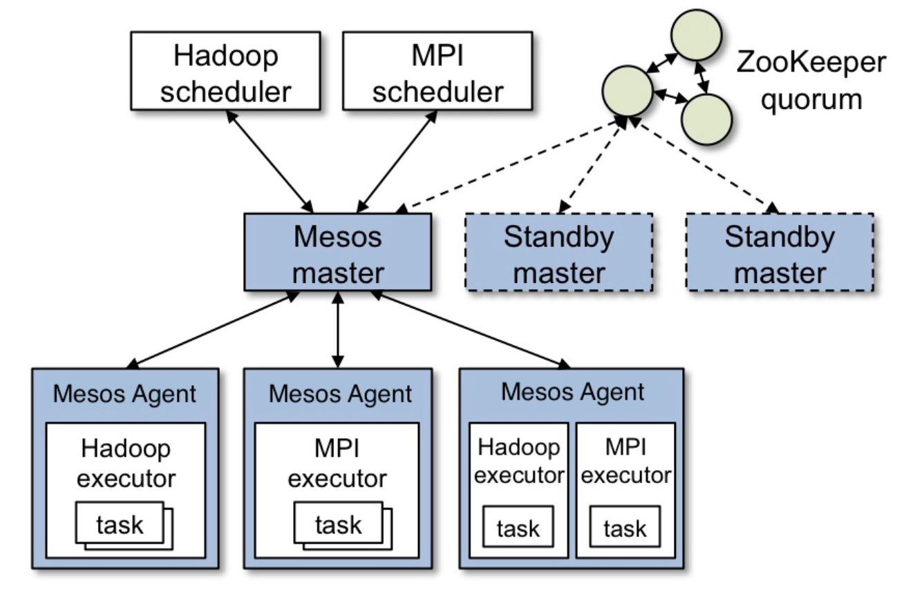

# Apache Mesos Architecture

## Table of Contents

- [Introduction](#introduction)
- [Understanding Mesos as an Operating System](#understanding-mesos-as-an-operating-system)
- [Native Container Image Support](#native-container-image-support)
- [The Architecture of Apache Mesos](#the-architecture-of-apache-mesos)
- [Embracing the Mesos Perspective](#embracing-the-mesos-perspective)
- [Relevant Documentation](#relevant-documentation)
- [Conclusion](#Conclusion)

## Introduction

Welcome to the world of Apache Mesos! In this guide, we'll explore the role of Mesos in the context of container orchestration and clarify its unique characteristics as an operating system for your data center.

## Understanding Mesos as an Operating System

Apache Mesos is often discussed in the context of container orchestration, but I want to highlight that it has more in common with the Linux kernel than with traditional container orchestration systems. Mesos acts as an operating system for your data center, just like the Linux kernel serves as the foundation for various Linux distributions.

Similar to how Linux distributions utilize the Linux kernel, Mesos works in conjunction with other frameworks. These frameworks can represent different applications such as Elasticsearch, Hadoop, or Kafka. Mesos enables these frameworks to communicate with it, request resources, and execute tasks. The key advantage is that Mesos facilitates resource sharing and efficient utilization across frameworks. You can think of Mesos as a way to create a unified pool of resources for your data center.

## Native Container Image Support

Mesos offers native container image support, similar to other container orchestration platforms like Docker Swarm and Kubernetes. You can create containers using Docker images without the need for the Docker engine itself. This flexibility is made possible through the Universal Container Runtime (UCR), which allows you to run Docker containers on Mesos without requiring Docker engine installations on every machine in your cluster. UCR has evolved over the years, supporting technologies like LXC, cgroups, namespaces, and Docker.

## The Architecture of Apache Mesos

At the core of the architecture is the Mesos master, responsible for fine-grained resource sharing. It makes resource offers to agents (formerly called slaves), which are the worker nodes in the cluster. Each framework, such as Elasticsearch or Kafka, consists of a scheduler that registers with the master and an executor process. The scheduler receives resource offers from the master and decides which offers to accept. The executor process launches agent nodes to execute the tasks defined by the framework.

In the event of a master failure, Mesos employs a backup master and relies on ZooKeeper to elect a new master. Similarly, if a slave goes down, the agent communicates with the slave through a ping-pong mechanism, and if no response is received, the slave is marked as down. Task persistence is ensured through distributed data centers. In the case of scheduler failure, ZooKeeper steps in and elects a new scheduler in a high availability setup.

The architecture of Mesos is designed to maximize resource utilization and provide redundancy within your data center. It allows for efficient communication and collaboration among frameworks, enabling them to leverage shared resources effectively.

## Embracing the Mesos Perspective

When discussing container orchestration, it's important to recognize that Apache Mesos serves a unique role as an operating system for your data center. You can compare it to a busy airport, where Mesos represents the airport itself, and each framework is like an airline. The tasks executed by the frameworks are akin to airplanes. This analogy helps visualize how Mesos facilitates resource allocation and task execution across various frameworks.

## Relevant Documentation

- [Mesos Architecture](https://mesos.apache.org/documentation/latest/architecture/)

## Conclusion

By understanding Mesos as an operating system, you'll be better equipped to contribute to container orchestration conversations. You can emphasize the resource-sharing capabilities and the role it plays in optimizing data center operations.