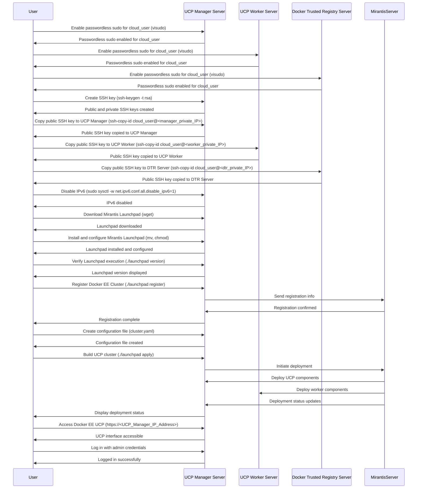

# Installing Docker Enterprise Edition (Docker EE)

## Table of Contents

- [Introduction](#introduction)
- [Background on Docker Editions](#background-on-docker-editions)
- [Prerequisites](#prerequisites)
- [Mirantis Overview](#mirantis-overview)
- [Difference between Docker CE and Docker EE](#difference-between-docker-ce-and-docker-ee)
- [Docker Enterprise Features](#docker-enterprise-features)
- [Sequence Diagram: Installing Docker EE with Mirantis Launchpad](#sequence-diagram-installing-docker-ee-with-mirantis-launchpad)
- [Installing Docker EE](#installing-docker-ee)
- [Relevant Documentation](#relevant-documentation)
- [Conclusion](#conclusion)

## Introduction

In this lesson, we explore the installation process for Docker Enterprise Edition, a licensed version of Docker with additional features.

## Background on Docker Editions

Previously in this course, we covered the Docker Community Edition (Docker CE), which is free and open-source. It offers core Docker engine features, including Docker swarm with swarm orchestration, networking, and security. The Community Edition has all the core functionalities necessary for most Docker users.

However, there's a licensed version known as Docker Enterprise Edition (Docker EE) that provides additional features for larger-scale, enterprise needs.

## Difference between Docker CE and Docker EE

Docker Community Edition (CE) is a free and open-source version of Docker that contains the core features of the Docker engine. With Docker CE:

- You receive all Docker engine updates.
- It includes Docker swarm with orchestration, networking, and security.
- It provides all the fundamental features required for Docker usage.

On the other hand, Docker Enterprise Edition offers:

- All the features of Docker CE.
- Universal Control Plane (UCP) - a web interface to manage Docker infrastructure.
- Docker Trusted Registry (DTR) - a Docker registry with advanced features.
- Vulnerability scanning for Docker images.
- Federated application management.

## Prerequisites

1. Three servers: 
- Large: Universal Control Plane Manager server.
- Small: UCP Worker.
- Medium: Docker Trusted Registry server.

If you're using a service like Cloud Playground, select the Ubuntu 18.04 Bionic Beaver LTS image for these servers.
   
2. Knowledge of Docker Community Edition.

3. Knwoledge of Mirantis LaunchPad.

## Mirantis Overview

Mirantis is a cloud technology company specializing in Kubernetes, containers, and formerly, OpenStack. They offer services, software, and training around these technologies, helping businesses navigate the modern cloud ecosystem.

### Key Points:

- **Historical Focus on OpenStack**: Mirantis was once deeply involved in the OpenStack community, offering support, training, and professional services.
  
- **Shift to Kubernetes & Containers**: Over time, Mirantis transitioned its focus towards the cloud-native landscape, emphasizing Kubernetes and containers.

- **Acquisition of Docker Enterprise**: In 2019, they acquired Docker Enterprise, gaining a suite of products designed to deploy containers at scale.

- **Services & Training**: Mirantis provides Kubernetes-as-a-service solutions and offers training/certifications in Kubernetes and Docker.

## Docker Enterprise Features

Docker Enterprise Edition, owned by Mirantis, encompasses all features of Docker CE and introduces new functionalities:

1. **Universal Control Plane (UCP):** A web interface for Docker infrastructure management.
2. **Docker Trusted Registry (DTR):** A Docker registry with advanced features surpassing the free Docker registry's capabilities.
3. **Vulnerability Scanning:** Automated security scans for Docker images.
4. **Federated Application Management:** Centralized application management system.

In essence, Docker Enterprise Edition simplifies application management at an enterprise scale.

## Sequence Diagram: Installing Docker EE with Mirantis Launchpad

In this section, we will walk you through the process of setting up Docker Enterprise Edition (Docker EE) using Mirantis Launchpad. This involves preparing your servers, configuring passwordless sudo and SSH authentication, disabling IPv6, and finally installing Docker EE. Below is a sequence diagram outlining these steps:



## Installing Docker EE

To get started with Docker EE, follow the steps outlined below:

1. **Prepare Your Servers**:
   
- Ensure you have three provisioned servers.
- Enable passwordless sudo for `cloud_user` on all three servers using `sudo visudo`:

```bash
sudo visudo
```

- At the bottom of the file, add `cloud_user ALL=(ALL) NOPASSWD: ALL`

2. **Set Up SSH Authentication**:

- On the UCP Manager server, create an SSH key `ssh-keygen -t rsa`:

```bash
ssh-keygen -t rsa
```

- Copy this key to all three servers using the `ssh-copy-id` utility:

```bash
ssh-copy-id cloud_user@<manager_private_IP>
ssh-copy-id cloud_user@<worker_private_IP>
ssh-copy-id cloud_user@<dtr_private_IP>
```

4. **Disable IPv6 Address**:

- On the UCP Manager server, disable `IPv6 Address`:

```bash
sudo sysctl -w net.ipv6.conf.all.disable_ipv6=1
sudo sysctl -w net.ipv6.conf.default.disable_ipv6=1
```

5. **Install Mirantis Launchpad**:

- Download the desired version of Launchpad, e.g., `wget [URL]`:

```bash
wget https://github.com/Mirantis/launchpad/releases/download/0.14.0/launchpad-linux-x64
```

- Rename and make the file executable:

```bash
mv launchpad-linux-x64 launchpad
chmod +x launchpad
```

- Verify that we can execute launchpad:

```bash
./launchpad version
```

6. **Register Your Docker EE Cluster**:

- Run `./launchpad register` and provide the necessary information.

```bash
./launchpad register
```

7. **Configure Your Cluster**:

- Create a configuration file `cluster.yaml`:

```bash
vi cluster.yaml
```

- Define the list of hosts, their roles (Manager/Worker), SSH details, etc.
- Provide specific configurations for utilities, such as UCP.

```yaml
apiVersion: launchpad.mirantis.com/v1beta3
kind: DockerEnterprise
metadata:
  name: launchpad-ucp
spec:
  ucp:
    version: 3.3.2
    installFlags:
    - --admin-username=admin
    - --admin-password=secur1ty!
    - --default-node-orchestrator=kubernetes
  hosts:
  - address: <manager_private_IP>
    privateInterface: ens5
    role: manager
    ssh:
      user: cloud_user
      keyPath: ~/.ssh/id_rsa
  - address: <worker_private_IP>
    privateInterface: ens5
    role: worker
    ssh:
      user: cloud_user
      keyPath: ~/.ssh/id_rsa
```

8. **Install Docker EE**:

- Build the UCP cluster using `./launchpad apply`:

```bash
./launchpad apply
```

9. **Access Docker EE UCP**:

- Access the UCP interface using a web browser at `https://<UCP_Manager_IP_Address>`.
- Log in with the admin credentials you specified.

## Relevant Documentation

- [Mirantis Products Documentation](https://docs.mirantis.com/welcome/)
- [Mirantis Launchpad on GitHub](https://github.com/Mirantis/launchpad)

## Conclusion

Docker Enterprise Edition offers an enhanced feature set for Docker users who require advanced functionalities for enterprise-scale operations. By following this guide, you've set up a Docker EE cluster and can now leverage its robust features. Happy Dockerizing! 🌱