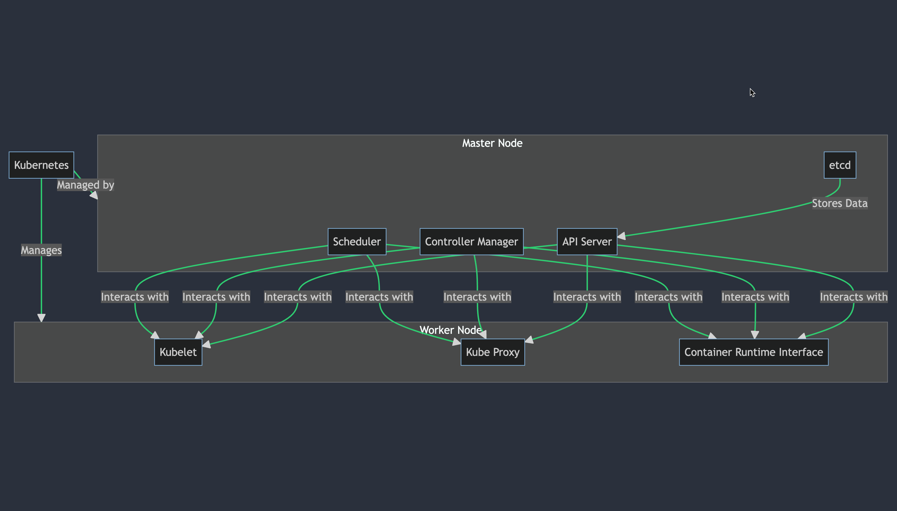

# Kubernetes Architecture

## Table of Contents

- [Introductionn](#introduction)
- [Kubernetes Architecture](#kubernetes-architecture)
- [Tutorial Commands](#tutorial-commands)
- [Conclusion](#conclusion)

## Introduction

A Kubernetes cluster is made up of multiple individual components running on the various machines that are part of the cluster. In this tutorial, we will briefly discuss the major Kubernetes software components and what each of them does. We will also look into how these components are actually running in our cluster currently.

## Kubernetes Architecture

### Component Diagram:

```bash
                    +-------------------------------+
                    |         Kubernetes            |
                    +-------------------------------+
                    |                               |
                    |   +-----------------------+   |
                    |   |  Master Components    |   |
                    |   +-----------------------+   |
                    |   |  - API Server         |   |
                    |   |  - Controller Manager |   |
                    |   |  - Scheduler          |   |
                    |   |  - etcd               |   |
                    |   +-----------------------+   |
                    |                               |
                    |   +-----------------------+   |
                    |   |   Worker Nodes        |   |
                    |   +-----------------------+   |
                    |   |  - kubelet            |   |
                    |   |  - kube-proxy         |   |
                    |   |  - Container Runtime  |   |
                    |   +-----------------------+   |
                    |                               |
                    |   +-----------------------+   |
                    |   |   Application         |   |
                    |   |   Components          |   |
                    |   +-----------------------+   |
                    |   |  - Pods               |   |
                    |   |  - Services           |   |
                    |   |  - Deployments        |   |
                    |   |  - ReplicaSets        |   |
                    |   +-----------------------+   |
                    |                               |
                    +-------------------------------+
```

The central component is the "Kubernetes" component, representing the core Kubernetes system. It consists of two main parts:

Master Components: These components handle the control and management of the cluster. They include:

- **API Server**: Provides the API for interacting with the cluster.
- **Controller Manage**r: Manages the controllers responsible for maintaining the desired state of the cluster.
- **Scheduler**: Assigns pods to worker nodes based on resource availability and scheduling policies.
- **etcd**: A distributed key-value store that stores the cluster's configuration and state.

Worker Nodes: These nodes host the application components and execute workloads. They consist of:

- **kubelet**: The primary node agent responsible for managing pods and communicating with the control plane.
- **kube-proxy**: Manages network connectivity and load balancing for services running on the node.
- **Container Runtime**: The container runtime is responsible for running containers within pods on the worker nodes. It manages the lifecycle of containers, including creating, starting, stopping, and destroying them. Common container runtimes used in Kubernetes include Docker, containerd, and CRI-O.

The "Application Components" component represents the application-specific components deployed on the Kubernetes cluster. These components include:

- **Pods**: The smallest deployable unit in Kubernetes, encapsulating one or more containers.
- **Services**: Provides stable network endpoints to access pods and enables service discovery.
- **Deployment**s: Manages the deployment and scaling of pods based on desired state.
- **$ReplicaSets**: Ensures a specified number of pod replicas are running and maintained.

### Communication Diagram:



## Tutorial Commands

1. Get a list of nodes running in the cluster:
```bash
kubectl get nodes -o wide
```

2. Get control plane components:
```bash
kubectl get componentstatuses
```

3. Get a list of system pods running in the cluster:
```bash
kubectl get pods -n kube-system
```

4. Determine which pods are running on which nodes in the kube-system namespace:
```bash
kubectl get pods -n kube-system -o wide
```

5. Check the status of the kubelet service:

```bash
sudo systemctl status kubelet
```

6. Get namespaces:
```bash
kubectl get namespaces
```

7. Get pods in kube-system namespace:
```bash
kubectl get pods -n kube-system -o wide
```

8. Get services in kube-system namespace:
```bash
kubectl get services -n kube-system
```

9. Get deployments in kube-system namespace:
```bash
kubectl get deployments -n kube-system
```

10. Get persistent volumes:
```bash
kubectl get pv
```

11. Get persistent volume claims:
```bash
kubectl get pvc --all-namespaces
```

## Conclusion

This tutorial provided an overview of the major components in a Kubernetes cluster. The Kubernetes architecture consists of the central "Kubernetes" component, including Master Components for cluster control, and Worker Nodes for executing workloads. Key components discussed include API Server, Controller Manager, Scheduler, etcd, kubelet, kube-proxy, and application-specific components like Pods, Services, Deployments, and ReplicaSets.